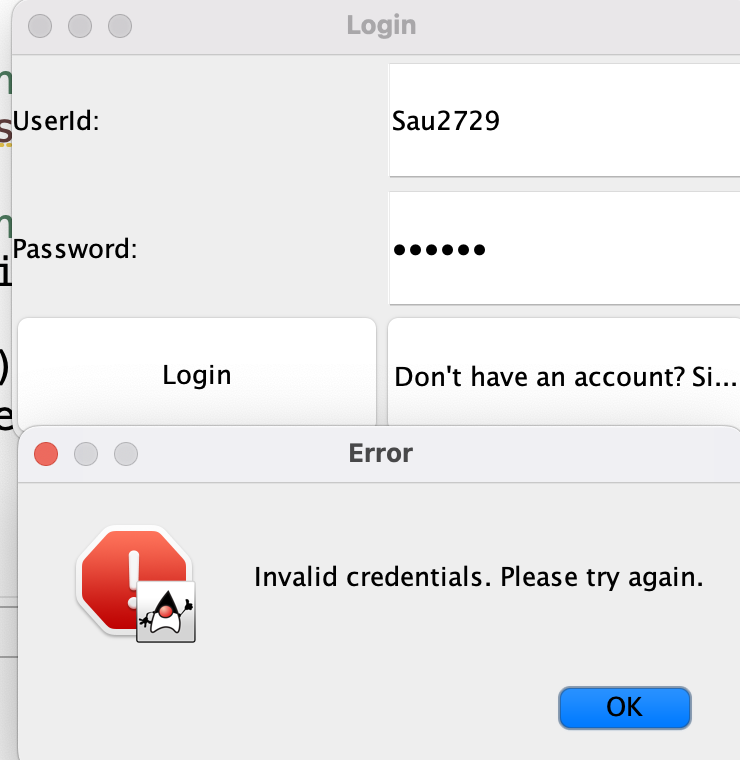

# Weekly Management System

## Introduction
Welcome to the Weekly Management System! This application enables users to efficiently manage their weekly scheduling needs. It offers features to schedule events, invite participants, and keep your week organized.

## Features
- Schedule weekly events.
- Invite participants to events.
- Organize and manage your week efficiently.
- View, edit, and delete events.

## Technologies Used
- Java
- Swing for UI
- SQLite for the database
- MVC architecture

## Prerequisites
Before you begin, ensure you have the following software installed:
- **Eclipse**: An IDE that supports Java and Swing projects.
- **Java (JDK)**: Required to compile and run Java applications.
- **MVC Architecture**: The project utilizes the Model-View-Controller architecture for structured development.
- **SQLite**: Manages the application's database.
- **Swing**: A Java library for creating graphical user interfaces.
- **DB Browser for SQLite** (Optional): Allows interaction with the SQLite database externally.

## Setup
Follow these steps to set up the Weekly Management System:

1. Clone the project repository to your local machine or download the source code.
2. Open Eclipse and import the project:
   - Go to `File > Open Projects from File System...`
   - Navigate to the project directory and import.
3. Ensure the JDK is properly configured in Eclipse:
   - Right-click on the project in the Project Explorer.
   - Select `Properties > Java Build Path`, then verify that the JDK library is listed under Libraries.
4. Import JAR files: Right-click on the project in Eclipse, go to `Build Path > Configure Build Path...`, then click `Add External JARs...` to select and import necessary JAR files.

5. Install SQLite, if not already installed, and configure it to work with Java.

## Running the Application
To run the Weekly Management System, execute the following steps:
1. Open the `main.java` file within Eclipse.
2. Compile the code using `javac main.java`.
3. Run the compiled file with `java main`.

## Contributing
Contributions are welcome! Please fork this repository and submit a pull request for any improvements or suggestions.

## Screenshots

1. **User Login Page**  
   

2. **User Signup Page**  
   

3. **Incorrect Details Popup**  
   

4. **Login Successful**  
   

5. **User Schedule**  
   

6. **Add Event**  
   

7. **Event Added**  
   

8. **Editing Event Upon Clicking on Event**  
   

9. **Edited Successfully**  
   

10. **Edited Event Showing in Table**  
    

11. **Deleting Event**  
    

12. **Event Deleted**  
    

13. **Login with Admin**  
    

14. **Schedule of All Users**  
    

15. **Dropdown to Switch Between Users**  
    

16. **Database Tables**  
    

17. **Users Table**  
    

18. **User Events Table**  
    
